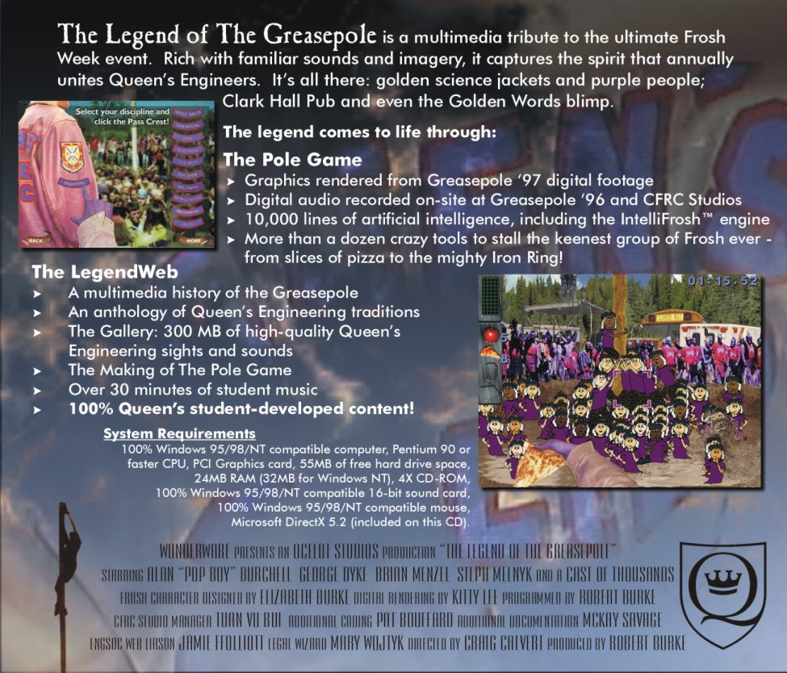

# Legend of the Greasepole

A multimedia tribute to the ultimate Frosh Week event at Queen's University.

**[Play the game online](https://robburke.net/gptest/)** (GDScript web version)

**[How to Play](docs/legendweb/how-to-play.md)** (Pit-side cheat sheet, a.k.a. "Cooks")

---

## About the Game

The Legend of the Greasepole captures the spirit of an event that annually unites Queen's Engineers. Rich with familiar sounds and imagery, it's all there: golden science jackets and purple people, Clark Hall Pub, and even the Golden Words blimp.

In The Pole Game, just like at the real pit, the Frosh only succeed when they learn to work as a team, taking advice from upper year students like the game's Al "Pop Boy" Burchell. And just like real life, the game tells the story of the Frosh's inevitable victory over the Pole. You can knock them down, but you know they'll get back up again. And even when you're teasing them, you know you really love 'em.

The Greasepole event is about spirit, and team building, and working together toward a common goal. It has brought Queen's Applied Science students together for decades, just as it will next year. Long may the tradition live on.



---

## History

| Year | Version | Technology | Status |
|------|---------|------------|--------|
| 1999 | Original | C++ | Archived (source not included) |
| 2007 | XBox | XNA + C++ | Archived (source not included) |
| 2010 | Silverlight | C# | **Canonical** - included as reference |
| 2025 | Godot C# | Godot 4.5.1 + C# | Complete(ish) |
| 2025 | Godot GDScript | Godot 4.5.1 + GDScript | Web-playable, actively refined |

### The Original (1999)
The game was originally written in C++ and released in 1999 (on CDs - remember those?). [Rob Burke](https://www.linkedin.com/in/robertcburke/) was the Producer, [Craig Calvert](https://www.linkedin.com/in/craig-calvert-61b4b91/) was the Artistic Director, and the game was created by a team of over 50 diverse Queens' students who brought the project to life. The original was accompanied by a [LegendWeb](https://robburke.net/greasepole/) including credits and images and sounds created during production (in need of a tune-up).

### XBox 360 Era (2007)
The game was ported to XBox using XNA Game Studio. This version brought the game to consoles for those who had a subscription to the XNA Creators Club.

### Silverlight Era (2010)
The game was ported to Microsoft Silverlight using C#. This version ran successfully for years until Silverlight was deprecated. The Silverlight codebase is included here as the **canonical reference** for game logic and behavior.

### Godot Revival feat. AI (2025)
Silverlight is dead, but the Greasepole is eternal. Working collaboratively with [Claude](https://claude.ai) (Anthropic's AI assistant), the game was ported in two stages:

1. **Silverlight C# → Godot C#**: A direct port preserving the original architecture and game logic. This version is feature-complete and runs "perfectly" as a desktop application.

2. **Godot C# → Godot GDScript**: Because Godot's C# support doesn't compile to WebAssembly, a second port to GDScript was necessary to enable web deployment. This version is playable online and being actively refined.

---

## Repository Structure

```
greasepole/
├── SilverLegend/           # Original Silverlight C# (canonical reference)
│   ├── SilverLegendCore/   # Core game logic
│   ├── SilverLegend/       # Silverlight app layer
│   └── SilverLegend.Web/   # ASP.NET web host
│
├── GodotLegend/            # Godot 4.5.1 C# port
│   ├── Core/               # Ported game logic
│   ├── Services/           # Godot service implementations
│   ├── Scenes/             # Godot scenes
│   └── Assets/             # Graphics (PNG) and Sound (MP3)
│
├── GodotLegendGD/          # Godot 4.5.1 GDScript port (web version)
│   ├── Core/               # Game logic in GDScript
│   ├── Services/           # GDScript service implementations
│   ├── Scenes/             # Godot scenes
│   └── Assets/             # Graphics (PNG) and Sound (MP3)
│
└── docs/
    ├── legendweb/          # Original LegendWeb content (credits, how to play)
    └── migration/          # Migration documentation and notes
```

---

## Running the Game

### Web (Easiest)
Visit **[robburke.net/gptest](https://robburke.net/gptest/)** to play in your browser.

### Godot GDScript (Local)
1. Install [Godot 4.5.1](https://godotengine.org/download) (standard version, not .NET)
2. Open `GodotLegendGD/project.godot`
3. Press F5 to run

### Godot C# (Local)
1. Install [Godot 4.5.1 .NET](https://godotengine.org/download) (.NET version required)
2. Install [.NET 8 SDK](https://dotnet.microsoft.com/download)
3. Open `GodotLegend/project.godot`
4. Press F5 to run

### Silverlight (Historical Reference Only)
The Silverlight version cannot be run in modern browsers. The code is included for reference purposes only.

---

## Future Work

- **Touch Interface**: Optimize the GDScript version for mobile/tablet touch controls
- **Remastering**: Potential visual and audio updates while preserving gameplay
- **Accessibility**: Improvements for broader accessibility

---

## Documentation

- **[How to Play](docs/legendweb/how-to-play.md)** - Game controls and item guide
- **[Credits](docs/legendweb/credits.md)** - Full credits for all 50+ contributors

---

## Credits

- **Original Game (1999)**: Created by a team of 50+ Queen's students. [Full credits](docs/legendweb/credits.md)
- **Godot Ports (2025)**: Developed collaboratively with [Claude](https://claude.ai) by Anthropic

---

## License

[MIT License](LICENSE) - Copyright (c) 1999-2025 Robert Burke and contributors

---

*Oil Thigh!*
