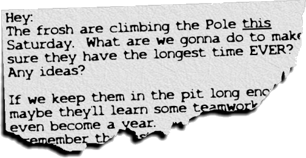
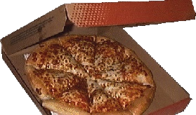
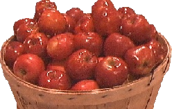
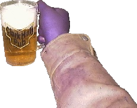
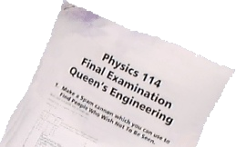
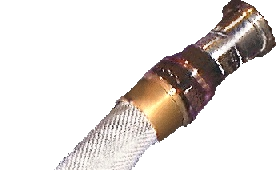
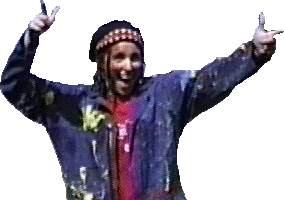

# How to Play

## The Pole Game: Pit-Side "Cooks"

I'm sure you've heard the story by now. The frosh this year are *way* too keen. We need to stall them, and make sure they spend enough time climbing the pole to learn the teamwork they'll need to survive the rest of their Engineering degree.

These are the things we've found around the pit that might come in handy in our effort to stall them.

---

## Pizza

Your favourite food group. Practice your sidearm with a click of the left mouse button. Using it as a weapon against the Frosh may seem a little cheesy, but if tossed strategically, it might take their minds off the task at hand. Also, I'm sure the EngSoc Prez and your buddies in the crowd wouldn't mind a few slices.

---

## Apple

You like apples? Click and hold the left mouse button to wind up a stronger shot! How do you like *them* apples?

Okay, we technically haven't thrown apples at the frosh for decades -- but desperate times call for desperate measures.

---

## Clark Mug o' Goodness

Golden soda straight from the Center of the Universe. It would be wrong for it to go to waste, so use the right mouse button to drink from the elixir. But if you're willing to click the left mouse button and part with some of it, the allure and subsequent effects of 6.5% ethanol might be put to good use.

---

## Phys 114 Exam

Some keener has brought copies of his 114 exam to the greasepit. I'm sure you know that these hideous pieces of paper should be handled with care, and there's got to be some way to turn this to our advantage.

Click the right mouse button to check your examination paper over and make sure there are no pages missing. Candidates will be reminded that clicking the left mouse button will give new meaning to the term "Smart Bomb." You may begin writing.

---

## Firehose

Someone in our year - I can't quite remember who - has a connection at the fire department, and she's convinced them to bring a firetruck to the greasepit! Just like in the good ol' days!

You know yourself that the Frosh love getting hosed. So click and hold the left mouse button to open the floodgates, and don't let up until the feedback gets the better of you.

---

## ArtScis

They're cute, they're lovable, but they don't belong at the pit. If one shows up, give 'em a shove with the left mouse button and let the Frosh act as judge, jury...

---

## Commies

What can one say about Commies that won't result in a million dollar lawsuit? A click of the left mouse button is worth a thousand words.

---

## Sci Cons

Just in case things get out of hand at the pit, keep an eye out for the Science Constables. They're *awesome* folks, and the *last* thing they want to do is spoil the fun. But they're here to make sure that everyone stays safe. So maybe just refrain from throwing stuff while they're watching you. And whatever you do, don't accidentally push them into the pit.

---

## Iron Ring

One last thing. The ancient rhymes tell of mystical, animalistic powers contained by the iron of the Ring. Excite and impress the Frecs with your acts of courage and lunacy, and the Iron Ring Forge will swing out and hit the mold 3 times. When the Ring glows and spins before you, click it with the left mouse button to unleash its power.

(I hear the Iron Ring Forge is powered by "creativity and excitement." I don't know really know what that mumbo jumbo means, but I'm guessing we have to experiment and do lots of crazy things to earn an Iron Ring. I bet it would help to make offerings of food and drink to your friends. Offerings of ArtScis and Commies couldn't hurt either. Oh, and I know we're working hard to stall the frosh, but be sure to enjoy yourself! Save some food and drink for yourself.)

